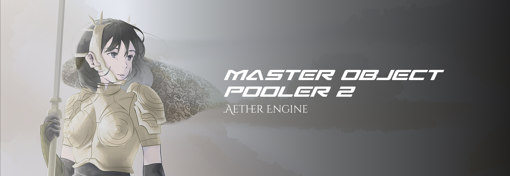

# Master Object Pooler 2
## Aether Engine (Godot 4.7 C#) port


A faithful port of QFSW's **Master Object Pooler 2** (originally a Unity asset used by the XRUIOS)
to the Aether Engine's Godot 4.7 + C# stack. The public API mirrors the original so existing usage
patterns carry over with minimal changes.

Ported for the XRUIOS, Echoes Online and Masuki Quest.

Original: https://github.com/QFSW/MasterObjectPooler2

Verified to compile clean (0 warnings / 0 errors) against `Godot.NET.Sdk/4.7.0`, `net8.0`.

<div align="center">

|                                                                                   |                                                                                                                                      |
| ------------------------------------------------------------------------------------------------------------------- | ---------------------------------------------------------------------------------------------------------------------------------------------------------------------- |
| **Code by WalkerDev**<br>“Loving coding is the same as hating yourself”<br>[Discord](https://discord.gg/H8h8scsxtH) | **Art by Kennaness**<br>“When will I get my isekai?”<br>[Bluesky](https://bsky.app/profile/kennaness.bsky.social) • [ArtStation](https://www.artstation.com/kennaness) |

</div>

<br>


<br>
<p align="center">
  <a href="https://walkerindustries.xyz">Walker Industries</a> •
  <a href="https://discord.gg/H8h8scsxtH">Discord</a> •
</p>

<p align="center">
  <a href="https://aetherengine.xyz" 
     style="font-size: 1.4em; color: #58a6ff; text-decoration: none;">
    <strong> Aether Engine </strong>
  </a>
    <a href="https://github.com/Walker-Industries-RnD/MasterObjectPooler2.AetherEngine" 
     style="font-size: 1.4em; color: #58a6ff; text-decoration: none;">
    <strong> View The Original </strong>
  </a>
</p>

## Layout

```
MasterObjectPooler2/
  addons/mop2/
    ObjectPool.cs          # Resource — a pool of instances of one PackedScene
    MasterObjectPooler.cs   # Node — manages named pools
    PoolableNode.cs         # Node3D base that can self-release to its pool
    AutoPool.cs             # Releases an object after a timer
    IPoolable.cs            # Interface for receiving the parent pool
    PopulateMethod.cs       # Set / Add enum
    NodeActivation.cs       # internal SetActive(node,bool) helper
  demo/
    ReleaseOnCollision.cs   # RigidBody3D that releases on collision (+ death FX)
    TriggerSpawner.cs       # Spawns pooled rigidbodies at a fixed rate
```

## Installing into an Aether/Godot project

Copy `addons/mop2/` into your project (it needs no `plugin.cfg` or `EditorPlugin` — the classes are
exposed to the editor via `[GlobalClass]`). Build the project's C# solution once; afterwards:

- **Object Pool** appears in the *Create Resource* dialog (mirrors Unity's `CreateAssetMenu`).
- **MasterObjectPooler**, **AutoPool**, etc. appear in the *Add Node* dialog.

## Usage

```csharp
using QFSW.MOP2;

// Create + initialize a pool at runtime
var pool = ObjectPool.CreateAndInitialize(myPackedScene, defaultSize: 20);

Node bullet = pool.GetObject(spawnPosition, spawnRotation);
RigidBody3D rb = pool.GetObjectComponent<RigidBody3D>(spawnPosition); // node-typed lookup, cached
pool.Release(bullet);

// Or via a MasterObjectPooler node, addressing pools by name
mop.GetObject("Bullet", spawnPosition);
mop.ReleaseAll("Bullet");
```

## Unity To Godot mapping

| Unity (MOP2)                        | Godot port                                             |
|-------------------------------------|--------------------------------------------------------|
| `GameObject` template (prefab)      | `PackedScene` template                                 |
| `ObjectPool : ScriptableObject`     | `ObjectPool : Resource` (`[GlobalClass]`)              |
| `MasterObjectPooler : MonoBehaviour`| `MasterObjectPooler : Node`                            |
| `Instantiate(template)`             | `PackedScene.Instantiate()`                            |
| `Object.Destroy(obj)`               | `Node.QueueFree()`                                     |
| `GameObject.SetActive(bool)`        | `NodeActivation.SetActive` (visibility + `ProcessMode`)|
| `transform.SetParent(...)`          | `Node.AddChild` / `Node.Reparent`                      |
| `GetComponent<T>()`                 | node is `T`, else first descendant of type `T`         |
| `GetInstanceID()` (`int`)           | `GetInstanceId()` (`ulong`)                            |
| `[SerializeField]` / `[Tooltip]`    | `[Export]` + XML doc comments                          |
| `ObjectParent` (`new GameObject`)   | lazily-created holder `Node3D` under the current scene |

## Intentional behavior differences

These stem from real engine differences, not omissions:

1. **Component model.** Godot has no components; nodes *are* the type. `GetObjectComponent<T>()`
   returns the instance itself when it is a `T`, otherwise the first descendant node of that type
   (cached by instance id + type, exactly like the original).

2. **Activation.** Unity toggles the whole GameObject with `SetActive`. Here a pooled (inactive) node
   is hidden (if it is a `Node3D`/`CanvasItem`) and has its `ProcessMode` set to `Disabled` so
   `_Process`/`_PhysicsProcess`/input stop firing — the closest equivalent.

3. **Template transform.** A `PackedScene` cannot be queried without instancing, so the template's
   local position/rotation/scale are captured from the first instance created and used as the defaults
   for the parameterless `GetObject()` / `Populate()`.

4. **Scene-change handling.** MOP2 subscribed to `SceneManager.sceneUnloaded` to cleanse and optionally
   repopulate. A Godot `Resource` has no scene-lifecycle callbacks, so this is exposed as a public
   `ObjectPool.Cleanse()` you call manually (e.g. before/after `SceneTree.ChangeSceneToFile`).
   `Purge()` remains available to destroy everything.

5. **Singleton mode.** `MasterObjectPooler` with `_singletonMode` reparents itself under the scene tree
   root (Godot's equivalent of `DontDestroyOnLoad`) and enforces a single `Instance`.

6. **`PoolableNode` base type.** The original `PoolableMonoBehaviour` was a component attachable to any
   object. The port derives from `Node3D` (attachable to any 3D node, including physics bodies). For 2D
   or `Control`-based pooled scenes, implement `IPoolable` directly instead.


## License & Artwork

**Code:** [NON-AI MPL 2.0](https://raw.githubusercontent.com/non-ai-licenses/non-ai-licenses/main/NON-AI-MPL-2.0)
**Artwork:** — **NO AI training. NO reproduction. NO exceptions.**


> Unauthorized use of the artwork — including but not limited to copying, distribution, modification, or inclusion in any machine-learning training dataset — is strictly prohibited and will be prosecuted to the fullest extent of the law.


